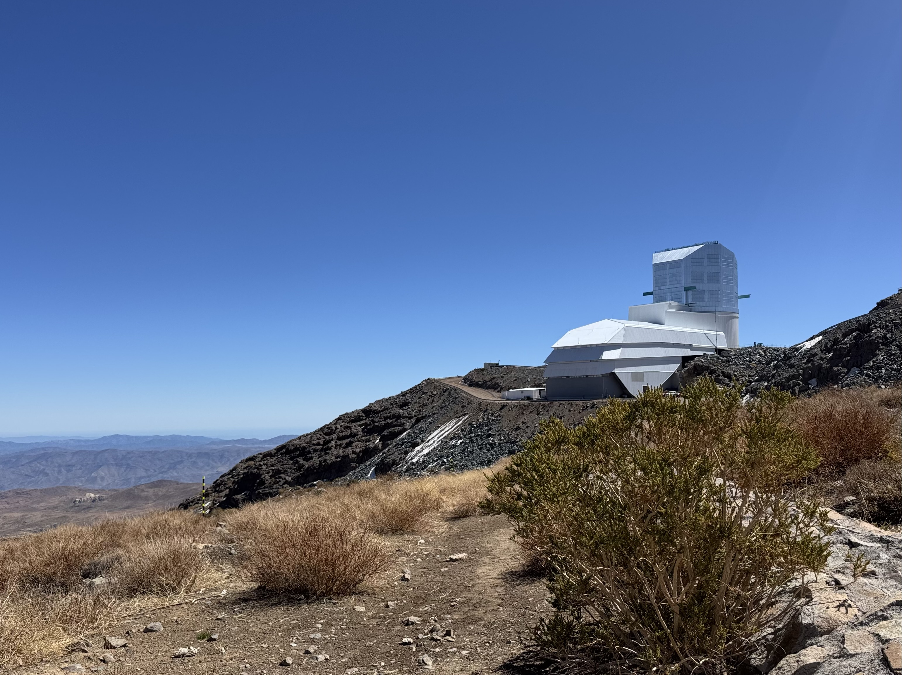
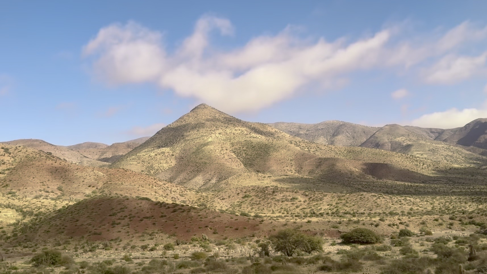
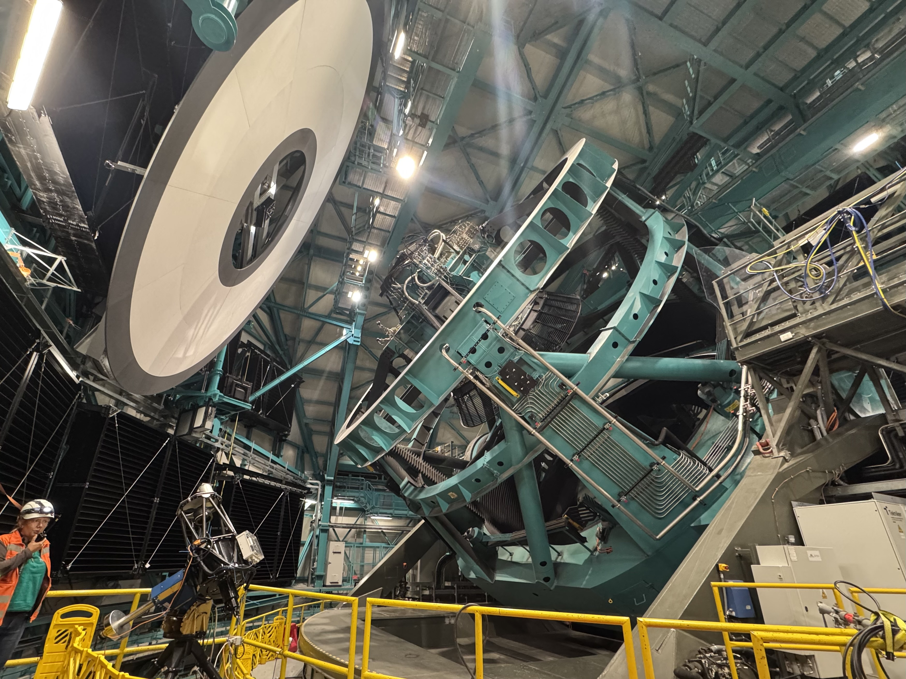
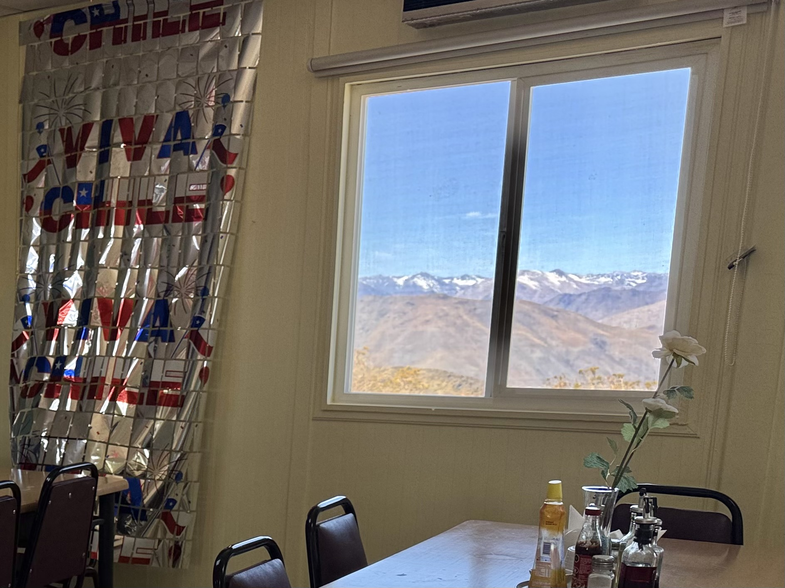
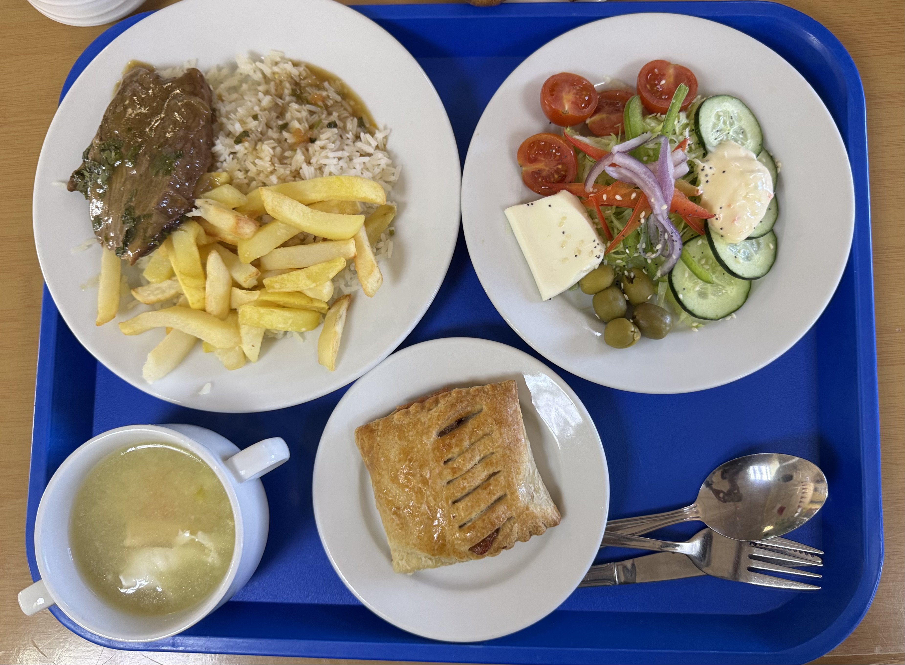
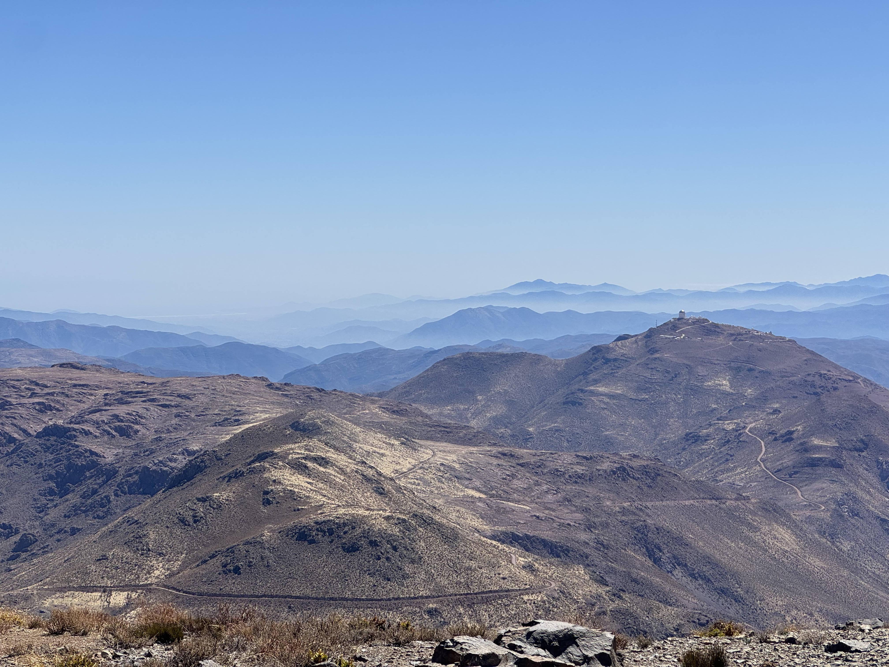

Cerro Pachónに新しくできた天文台に遊びに行ったときの話。
<!--more-->

 
ついにRubin天文台に行った。Santiago-La serena間の飛行機からは山頂で光る天文台を見たことがあったが、実際に訪れるのは初めて。

----
La Serenaの研究所から山頂までバスで2時間半。サボテンが点在する荒野の道を走っていった。

到着後、Rubin天文台のツアー(90分)に参加。装置優先の環境なので暗くて寒く、幼児連れには辛いものがあった。装置や鏡の蒸着を行う部屋を見たあと、望遠鏡と対面した。副鏡が思ったよりゴツくて光が入ってくる部分が狭い気がして、びっくりした。
 

----
そしてカフェテリアでランチ。地上は雪降らないので、窓からの雪山が印象的。

昼食は思ったより色々選べて豪華だった。一番美味しかったのはスープ。寒かったし。ハズレは牛肉。チリの牛は赤身ばっかりで焼いただけだと本当に固い。豚肉にすればよかった。

----

最後に一人で少し散策した。
山頂からの絶景。遠くに別の天文台も見えた。夜空はまた良いだろうな。見てみたい。
 