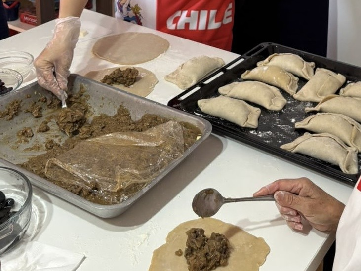
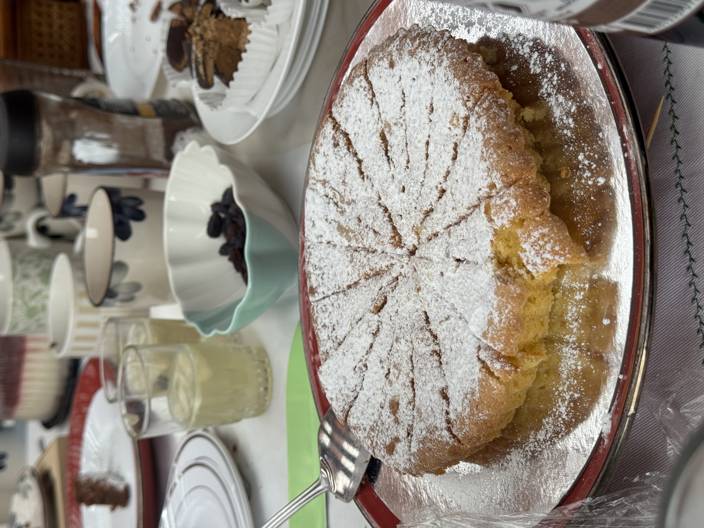
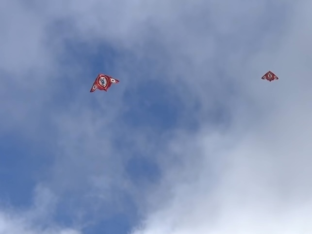

子どもの同級生の家族からDieciocho(ディエシオチョ:独立記念日)のパーティーに招待されて、一緒に過ごした。
<!--more-->
 
チリの家庭料理エンパナーダを大量に作って焼いて30人くらいで宴会した。ピスコサワーとチェリモヤ酒もいただいた(果実の味がそのままでおいしいけどアルコール度数高いので危ない)。

 
自分が久々に気合い入れて焼いたケーキ(Torta Caprese)は好評で安心した。

----

宴会のあと近くの空き地で大人も子どもも一緒にコマ回し(trompo)と凧揚げ(volantín)で盛り上がった。夫がコマ回すだけで大歓声だった。
チリではDieciochoの伝統的な遊びだそうだ。コマも凧も日本で見るものとは形が少し違うけど、似た遊びが親しまれているのはおもしろい。

翌日はまた別の友達一家と昼からサンティアゴのオヒギンス広場で行われる軍事パレードの中継をダラダラ見て、BBQした。

----

Dieciochoはなんだか自分の子どものころのお正月みたいだった。今の日本では規制多くてなかなか凧揚げもBBQも難しそう。あと家族がここまで集まるのも。
ちなみにチリではDieciochoの18日と翌日19日は強制休業日らしい。休みだけど他に遊びに行くところもないし、だからここまで家族が集まれるんだな〜と思った。一方、治安が悪すぎて空き巣が怖いので家を開けて来られない人がいるという話も今回のパーティーで話題になってた。

ともあれ故郷から遠く離れた地で暮らしていて、こうして家族の集まりに混ぜて暖かく接してくれる人たちとご縁があったのは本当にありがたくて嬉しい。